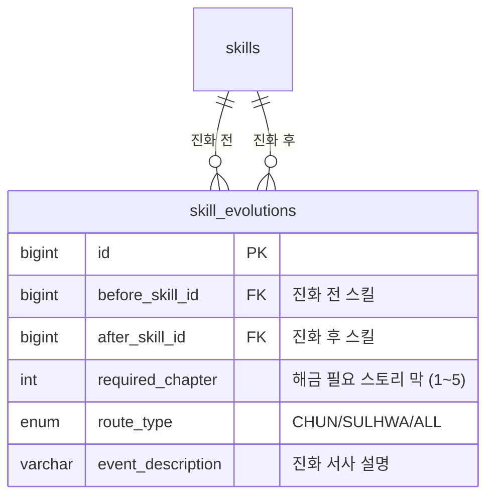
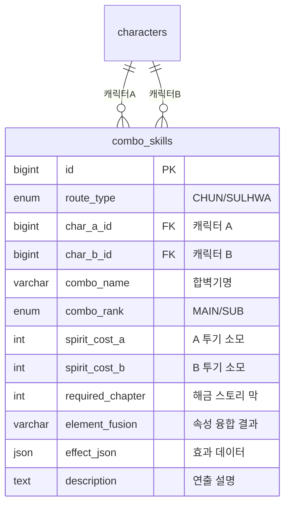
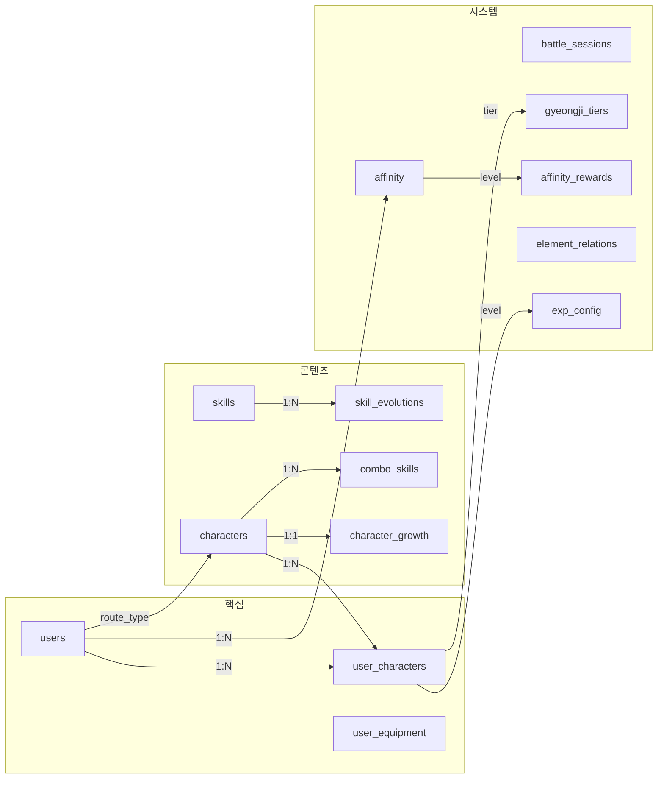

# 🗄️ Phase 2 추가: 신규 시스템 DB 스키마

> **프로젝트**: 한월(韓月)  
> **작성일**: 2026-05-09  
> **기반**: Phase2-LLD-DB-API설계.md 확장  
> **변경 사유**: SP 이원화, 루트 시스템, 스킬 진화, 합벽기, 경지 돌파, 호감도, 진형 추가

---

## 0. 기존 테이블 변경사항

### 0-1. 속성 ENUM 변경 (전체 적용)

```sql
-- 기존: ENUM('FIRE','WATER','WIND','EARTH','LIGHTNING')
-- 변경: ENUM('METAL','WOOD','EARTH','WATER','FIRE','VOID')
-- METAL(금), WOOD(목), EARTH(토), WATER(수), FIRE(화), VOID(무/특수)
-- ※ 뇌전(雷電)은 METAL의 상위 표현 (별도 속성 아님)
```

적용 대상: `characters.element`, `skills.element`, `enemy_weaknesses.element`, `dungeons.element`

### 0-2. users 테이블 추가 컬럼

```sql
ALTER TABLE users
  ADD COLUMN route_type ENUM('CHUN','SULHWA') DEFAULT NULL 
    COMMENT '선택 루트 (남궁천/남궁설화). 최초 선택 후 변경 불가',
  ADD COLUMN story_chapter INT DEFAULT 0 
    COMMENT '현재 스토리 진행 막 (0=프롤로그, 1~5=각 막)';
```

### 0-3. battle_sessions 테이블 추가 컬럼

```sql
ALTER TABLE battle_sessions
  ADD COLUMN party_energy INT DEFAULT 3 COMMENT '파티 공용 기력 (0~5)',
  ADD COLUMN formation_json JSON COMMENT '진형 배치 {"front":[id1,id2],"back":[id3,id4]}';

-- 기존 current_sp → party_energy로 의미 변경
-- 투기는 캐릭터별 개인 게이지이므로 party_snapshot JSON 내에 포함
```

### 0-4. skills 테이블 수정

```sql
ALTER TABLE skills
  ADD COLUMN spirit_gain INT DEFAULT 0 COMMENT '투기 획득량 (평타:1, 스킬:2)',
  ADD COLUMN spirit_cost INT DEFAULT 0 COMMENT '투기 소모량 (궁극기:6)',
  ADD COLUMN scaling_stat ENUM('ATK','DEF','HP') DEFAULT 'ATK' 
    COMMENT '데미지 스케일링 기준 스탯';

-- 기존 sp_cost → 기력 소모량으로 의미 변경 (평타:+1, 스킬:-1)
-- 기존 energy_gain → 제거 (투기로 대체)
```

---

## 1. 신규 테이블: 스킬 진화



```sql
CREATE TABLE skill_evolutions (
    id BIGINT PRIMARY KEY AUTO_INCREMENT,
    before_skill_id BIGINT NOT NULL,
    after_skill_id BIGINT NOT NULL,
    required_chapter INT NOT NULL COMMENT '해금 스토리 막 (1~5)',
    route_type ENUM('CHUN','SULHWA','ALL') NOT NULL DEFAULT 'ALL',
    event_description TEXT COMMENT '진화 이벤트 서사',
    created_at DATETIME DEFAULT CURRENT_TIMESTAMP,
    FOREIGN KEY (before_skill_id) REFERENCES skills(id),
    FOREIGN KEY (after_skill_id) REFERENCES skills(id)
);

-- 예시 데이터
INSERT INTO skill_evolutions (before_skill_id, after_skill_id, required_chapter, route_type, event_description) VALUES
(1, 10, 1, 'CHUN', '36계 줄랑랑 → 창궁대연보: 시조의 창궁대연신공을 습득하며 진화'),
(2, 11, 1, 'CHUN', '흙 뿌리기 → 창궁일송: 대지의 기운을 검에 담아 진화'),
(3, 20, 1, 'SULHWA', '꺄악! 비명지르기 → 빙백한풍: 만년서리의 기운으로 진화'),
(4, 21, 1, 'SULHWA', '짱돌 투척 → 빙백투창: 빙기를 돌에 담아 진화');
```

---

## 2. 신규 테이블: 합벽기



```sql
CREATE TABLE combo_skills (
    id BIGINT PRIMARY KEY AUTO_INCREMENT,
    route_type ENUM('CHUN','SULHWA') NOT NULL,
    char_a_id BIGINT NOT NULL,
    char_b_id BIGINT NOT NULL,
    combo_name VARCHAR(100) NOT NULL,
    combo_rank ENUM('MAIN','SUB') NOT NULL DEFAULT 'MAIN',
    spirit_cost_a INT NOT NULL DEFAULT 6,
    spirit_cost_b INT NOT NULL DEFAULT 6,
    required_chapter INT NOT NULL,
    element_fusion VARCHAR(50) COMMENT '속성 융합 결과 (예: 용암, 동결독)',
    effect_json JSON NOT NULL COMMENT '효과 상세 데이터',
    description TEXT,
    created_at DATETIME DEFAULT CURRENT_TIMESTAMP,
    FOREIGN KEY (char_a_id) REFERENCES characters(id),
    FOREIGN KEY (char_b_id) REFERENCES characters(id)
);

INSERT INTO combo_skills (route_type, char_a_id, char_b_id, combo_name, combo_rank, spirit_cost_a, spirit_cost_b, required_chapter, element_fusion, effect_json, description) VALUES
('CHUN', 1, 7, '염토쌍무 - 폭염지진', 'MAIN', 6, 6, 3, '용암(熔岩)',
 '{"damage_type":"AOE","scaling":"DEF","multiplier":4.5,"debuffs":[{"type":"BURN","turns":3},{"type":"SPD_DOWN","turns":2,"value":30}]}',
 '천이 대지의 검기로 땅을 갈라 적을 가둠 → 아린이 적련화도로 불을 쏟아부음'),
('CHUN', 1, 12, '강철지벽', 'SUB', 4, 4, 2, '대지(大地)',
 '{"damage_type":"NONE","buff":{"type":"SHIELD","target":"ALL_ALLY","scaling":"DEF_SUM","multiplier":2.0}}',
 '두 탱커가 방어력을 합쳐 아군 전체에 초거대 보호막'),
('SULHWA', 2, 11, '빙독쌍련 - 극한독화', 'MAIN', 6, 6, 3, '동결독(凍結毒)',
 '{"damage_type":"AOE","multiplier":3.8,"debuffs":[{"type":"FREEZE","turns":1,"guaranteed":true},{"type":"POISON","turns":3,"irremovable":true},{"type":"FREEZE_EXPLODE","on_thaw":true}]}',
 '설화가 빙백한풍으로 얼림 → 소소가 균열 사이로 맹독 투입'),
('SULHWA', 2, 6, '현빙무영 - 한월장막', 'SUB', 4, 4, 2, '절대영도(絕對零度)',
 '{"damage_type":"AOE","multiplier":4.0,"debuffs":[{"type":"FREEZE","turns":2},{"type":"PURGE_BUFF","all":true}],"special":{"condition":"SULHWA_HP_BELOW_30","effect":"HEAL_50_PERCENT"}}',
 '남궁현이 무영검 결계 → 설화가 빙기 폭발. HP<30%시 할배 보호');
```

---

## 3. 신규 테이블: 경지 돌파

```sql
CREATE TABLE gyeongji_tiers (
    id BIGINT PRIMARY KEY AUTO_INCREMENT,
    tier_name VARCHAR(50) NOT NULL COMMENT '경지명',
    tier_order INT NOT NULL COMMENT '순서 (1=삼류, 6=현경)',
    level_min INT NOT NULL,
    level_max INT NOT NULL,
    required_chapter INT COMMENT '돌파 필요 스토리 막',
    stat_bonus_percent DECIMAL(5,2) DEFAULT 0 COMMENT '전 스탯 보너스%',
    unlock_content VARCHAR(200) COMMENT '해금 콘텐츠',
    breakthrough_material VARCHAR(100) COMMENT '돌파 재화',
    breakthrough_quantity INT DEFAULT 0
);

INSERT INTO gyeongji_tiers VALUES
(1, '삼류(三流)', 1, 1, 15, NULL, 0, '기본 스킬 2개', NULL, 0),
(2, '이류(二流)', 2, 16, 25, 1, 5.00, '진화 스킬 해금', '돌파석', 5),
(3, '일류(一流)', 3, 26, 35, 2, 5.00, '서브 합벽기 해금, 스킬 슬롯+1', '돌파석', 15),
(4, '초일류(超一流)', 4, 36, 45, 3, 10.00, '궁극기 해금, 메인 합벽기 해금', '돌파석', 30),
(5, '화경(化境)', 5, 46, 55, 4, 10.00, '패시브 강화, 전용 장비 해금', '돌파석', 50),
(6, '현경(玄境)', 6, 56, 60, 5, 15.00, '합벽기 강화, 최종 스킬 해금', '천상돌파석', 10);
```

---

## 4. 신규 테이블: 호감도

```sql
CREATE TABLE affinity (
    id BIGINT PRIMARY KEY AUTO_INCREMENT,
    user_id BIGINT NOT NULL,
    character_id BIGINT NOT NULL,
    affinity_level INT DEFAULT 1 COMMENT '인연 등급 (1~10)',
    affinity_exp INT DEFAULT 0 COMMENT '현재 호감도 경험치',
    created_at DATETIME DEFAULT CURRENT_TIMESTAMP,
    updated_at DATETIME DEFAULT CURRENT_TIMESTAMP ON UPDATE CURRENT_TIMESTAMP,
    UNIQUE KEY uk_user_char (user_id, character_id),
    FOREIGN KEY (user_id) REFERENCES users(id),
    FOREIGN KEY (character_id) REFERENCES characters(id)
);

CREATE TABLE affinity_rewards (
    id BIGINT PRIMARY KEY AUTO_INCREMENT,
    affinity_level INT NOT NULL COMMENT '해금 인연 등급',
    combo_damage_bonus DECIMAL(5,2) DEFAULT 0 COMMENT '합벽기 데미지 보너스%',
    unlock_content VARCHAR(200) COMMENT '해금 콘텐츠'
);

INSERT INTO affinity_rewards VALUES
(1, 1, 0, '기본 대화'),
(2, 3, 10.00, '사이드 스토리 1'),
(3, 5, 20.00, '사이드 스토리 2'),
(4, 7, 30.00, '전용 장비 해금'),
(5, 10, 50.00, '최종 스토리 + 전용 칭호');
```

---

## 5. 신규 테이블: 캐릭터 성장률

```sql
CREATE TABLE character_growth (
    id BIGINT PRIMARY KEY AUTO_INCREMENT,
    character_id BIGINT NOT NULL,
    hp_grade ENUM('S','A','B','C','D') NOT NULL,
    atk_grade ENUM('S','A','B','C','D') NOT NULL,
    def_grade ENUM('S','A','B','C','D') NOT NULL,
    spd_growth_per_level DECIMAL(4,2) DEFAULT 0.20,
    ehr_growth_per_level DECIMAL(4,2) DEFAULT 0.10,
    ers_growth_per_level DECIMAL(4,2) DEFAULT 0.10,
    crt_growth_per_level DECIMAL(4,2) DEFAULT 0.00,
    spirit_bonus_condition VARCHAR(100) COMMENT '투기 보너스 조건',
    spirit_bonus_amount INT DEFAULT 0,
    UNIQUE KEY uk_char (character_id),
    FOREIGN KEY (character_id) REFERENCES characters(id)
);

-- 성장 등급별 배율: S=0.068, A=0.051, B=0.034, C=0.025, D=0.017
-- 레벨당 성장값 = 기본값 × 배율
-- Lv60 예상값 = 기본값 + (성장값 × 59)
```

---

## 6. 신규 테이블: 경험치 설정

```sql
CREATE TABLE exp_config (
    level INT PRIMARY KEY,
    required_exp INT NOT NULL COMMENT '다음 레벨까지 필요 경험치',
    cumulative_exp BIGINT NOT NULL COMMENT '누적 경험치'
);

-- 공식: required_exp = 100 + (level × 30) + (level² × 5)
-- Python 스크립트로 자동 생성 (game-balance-data.xlsx 경험치테이블 시트 참조)
```

---

## 7. 신규 테이블: 오행 상성

```sql
CREATE TABLE element_relations (
    id BIGINT PRIMARY KEY AUTO_INCREMENT,
    attack_element ENUM('METAL','WOOD','EARTH','WATER','FIRE','VOID') NOT NULL,
    defend_element ENUM('METAL','WOOD','EARTH','WATER','FIRE','VOID') NOT NULL,
    damage_multiplier DECIMAL(3,2) NOT NULL DEFAULT 1.00,
    UNIQUE KEY uk_elements (attack_element, defend_element)
);

-- 상극: 금→목(1.3), 목→토(1.3), 토→수(1.3), 수→화(1.3), 화→금(1.3)
-- 피극: 역방향 (0.7)
-- 무(VOID): 모든 관계 1.0
INSERT INTO element_relations (attack_element, defend_element, damage_multiplier) VALUES
('METAL','WOOD',1.30), ('WOOD','EARTH',1.30), ('EARTH','WATER',1.30),
('WATER','FIRE',1.30), ('FIRE','METAL',1.30),
('WOOD','METAL',0.70), ('EARTH','WOOD',0.70), ('WATER','EARTH',0.70),
('FIRE','WATER',0.70), ('METAL','FIRE',0.70);
-- VOID 및 동일 속성은 기본값 1.00 (조회 시 없으면 1.0 반환)
```

---

## 8. 추가 인덱스

```sql
-- 스킬 진화
CREATE INDEX idx_skill_evo_route ON skill_evolutions(route_type, required_chapter);

-- 합벽기
CREATE INDEX idx_combo_route ON combo_skills(route_type);
CREATE INDEX idx_combo_chars ON combo_skills(char_a_id, char_b_id);

-- 호감도
CREATE INDEX idx_affinity_user ON affinity(user_id);

-- 경지
CREATE INDEX idx_gyeongji_order ON gyeongji_tiers(tier_order);

-- 성장률
CREATE INDEX idx_growth_char ON character_growth(character_id);
```

---

## 9. 전체 ERD 관계도 (신규 포함)



---

> 📌 이 문서는 기존 Phase2-LLD-DB-API설계.md의 **확장 문서**입니다.  
> 기존 테이블(users, characters, skills, battle_sessions 등)의 ALTER 구문과 신규 7개 테이블을 포함합니다.
